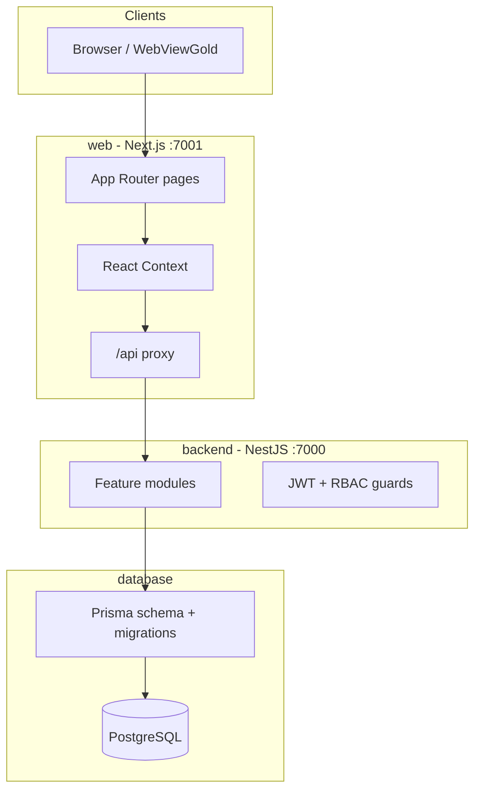
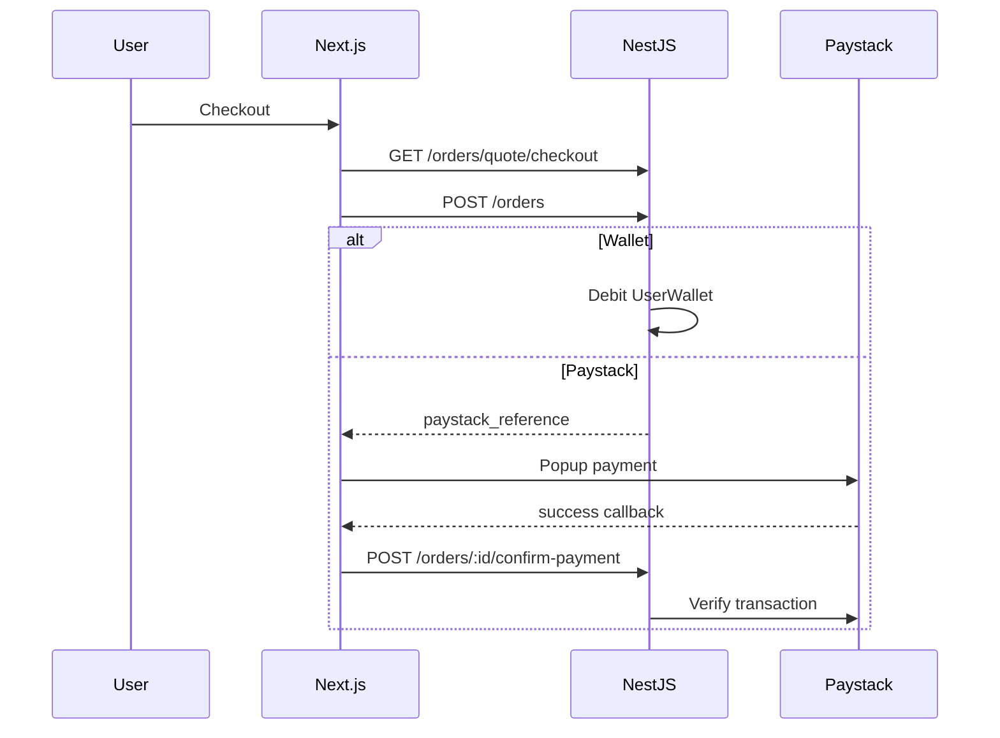

# ThinQShop — Project Understanding

Canonical architecture reference for contributors and AI agents. For setup commands, see [README.md](../README.md) and [LOCAL_DEV.md](./LOCAL_DEV.md).

## What it is

**ThinQShop** (`thinqshop-monorepo`) is a full-stack platform for **e-commerce plus financial/logistics services**, aimed at Ghana (GHS, Paystack, local SMS). The README describes it as a "premium e-commerce and money transfer platform."

This is **not** React Native, Expo, or Flutter. The "app" is a **Next.js web app** (mobile-first), optionally wrapped in **WebViewGold** for store distribution (`web/lib/webviewGoldClient.ts`, `web/components/WebViewGoldBridge.tsx`).

---

## Monorepo layout



| Path | Role |
|------|------|
| `backend/` | NestJS REST API, business logic, Paystack/SMS |
| `web/` | Next.js 14 App Router — shop, auth, customer dashboard, admin |
| `database/` | Prisma schema (~40 models), migrations, seeds |
| `packages/shared-types/` | Shared TypeScript types across workspaces |
| `docs/` | Deploy, Paystack, logistics, SEO, enhancement plans |
| `scripts/` | `dev:start`, DB migrate/seed, deploy smoke checks |
| Root `package.json` | npm workspaces; `dev:backend`, `dev:web`, Docker builds |

**Dev ports:** API **7000**, web **7001**.

---

## Tech stack

- **Backend:** NestJS 10, Prisma 5, PostgreSQL, Passport JWT, Swagger (`/api/docs`), Helmet, throttling, optional Sentry
- **Web:** Next.js 14, React 18, Tailwind, Axios, react-hook-form + Zod, Framer Motion, Paystack (`react-paystack`), Vitest + Playwright
- **Payments:** Paystack (not Stripe)
- **SMS:** Arkesel
- **Deploy:** Docker Compose, Coolify ([DEPLOY.md](../DEPLOY.md), [COOLIFY_DEPLOY.md](./COOLIFY_DEPLOY.md))
- **CI:** `.github/workflows/ci.yml` — Prisma generate, backend build/test, web build

---

## Request flow (frontend → backend)

1. Browser uses Axios with `baseURL: '/api'` (`web/lib/axios.ts`)
2. Next.js catch-all proxy forwards to NestJS (`web/app/api/[...path]/route.ts`) using `BACKEND_URL` or `NEXT_PUBLIC_API_URL`
3. JWT in `localStorage` (`token`); cookies `thinq_session` + `thinq_role` for `web/middleware.ts` route guards
4. 401 → clear session, redirect to `/login?session=expired`

---

## Major product surfaces

### Public storefront (`web/app/(main)/`)

- Home, shop/categories, product detail, cart, checkout (wallet or Paystack)
- Wishlist, order tracking, static pages (terms, privacy, about, contact)
- CMS-driven content (hero, trust badges, testimonials) from backend `content` module

### Customer dashboard (`/dashboard/*`)

- Wallet (top-up via Paystack), orders, profile, settings (incl. delete account)
- **Money transfers** to China (`/finance/transfers`)
- **Logistics** — ship-for-me, freight ([LOGISTICS_SHIP_FOR_ME_PLAN.md](./LOGISTICS_SHIP_FOR_ME_PLAN.md))
- **Procurement** — request quotes, accept/pay
- Support tickets, notifications

### Admin (`/admin/*`)

- Products, categories, variations, orders, users
- Logistics, procurement, transfers, wallet oversight
- Storefront CMS, media library, reviews, shipping/invoice rates
- Invoices, email templates, audit logs, settings

---

## State management (frontend)

React Context only — no Redux/Zustand:

| Context | File | Notes |
|---------|------|-------|
| Auth | `web/context/AuthContext.tsx` | JWT login; admins → `/admin`, users → `/dashboard` |
| Cart | `web/context/CartContext.tsx` | Server-synced when logged in (`CartItem` in DB) |
| Wishlist | `web/context/WishlistContext.tsx` | **localStorage only** (not synced to Prisma `Wishlist`) |
| Currency | `web/context/CurrencyContext.tsx` | GHS / USD / CNY display |

Layouts: `web/components/layout/ShopLayout.tsx` (storefront), `web/components/layout/DashboardLayout.tsx` (dashboard/admin + mobile bottom nav).

Provider tree: `web/app/(main)/layout.tsx` wraps Auth → Currency → Wishlist → Cart.

---

## Auth and roles

**Backend** (`backend/src/auth/`): `POST /auth/login`, `/register`, forgot/reset password; global `AuthGuard` + `PermissionGuard` with `@RequirePermission()` for admin RBAC.

**Roles** (`User.role` in `database/schema.prisma`):

- `user` — default customer
- `admin` / `superadmin` — full admin (`backend/src/auth/permissions.ts`)
- `moderator` — read-only subset
- **No vendor/merchant role**

---

## Data model (high level)

Prisma schema is the source of truth (~40 models). Core domains:

- **Users:** `User`, `UserProfile`, `UserWallet`, `Address`
- **Shop:** `Product`, `Category`, variants, `CartItem`, `Order`, `OrderItem`, `Coupon`, `ProductReview`
- **Finance:** `MoneyTransfer`, `Payment`, `ExchangeRate`, `ShopCurrencyRate`
- **Logistics:** `Shipment`, warehouses, shipping zones/rates
- **Procurement:** `ProcurementRequest`, quotes, orders, tracking
- **Admin/CMS:** `Media`, `HeroSlide`, `Invoice`, `EmailTemplate`, `Notification`, etc.

---

## Payment flows (simplified)



Same Paystack pattern for **wallet top-up** and **money transfers**. Webhook: `POST /payments/webhook` (`backend/src/finance/payment.service.ts`).

Key UI: `web/app/(main)/checkout/CheckoutClient.tsx`, `web/components/payments/PaystackTrigger.tsx`.

---

## Backend modules (feature map)

Registered in `backend/src/app.module.ts`:

`auth`, `users` (UserModule), `products`, `cart`, `orders`, `addresses`, `finance` (wallet/transfers/payments), `logistics`, `procurement`, `notifications`, `media`, `content`, `track`, `variations`, `sms`, `invoices`, `audit`, `support`, `email-template`, `database` (admin DB tools).

Swagger: `http://localhost:7000/api/docs`. Health: `GET /health`, `GET /ready`.

---

## Local development (quick reference)

```bash
npm install
# Set .env from .env.example (DATABASE_URL, JWT_SECRET, Paystack keys)
docker compose up -d db   # optional
npm run dev:start         # or separate: dev:backend + dev:web
# Open http://localhost:7001
```

More detail: [LOCAL_DEV.md](./LOCAL_DEV.md), [LOCAL_SETUP_AND_TEST.md](./LOCAL_SETUP_AND_TEST.md).

---

## Related docs (roadmap / deep dives)

The `docs/` folder also contains enhancement and review plans (world-class ecommerce, shipping rates, currency converter, admin invoices, safe implementation phases). Those are product context — not every item is implemented yet.

See also [UNIFIED_PLATFORM_REVIEW.md](./UNIFIED_PLATFORM_REVIEW.md) and [PAYSTACK_WALLET_IMPLEMENTATION.md](./PAYSTACK_WALLET_IMPLEMENTATION.md).
